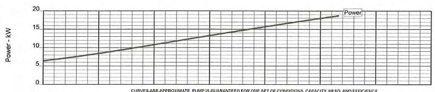
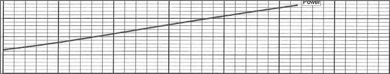
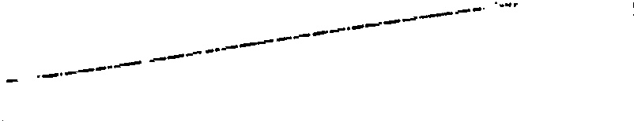
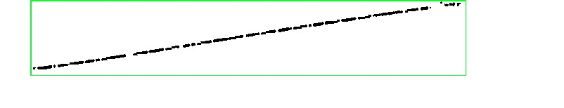
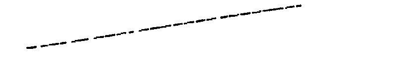

# Extracting function from figures

## Import Packages
```put here all the imported packages at the end of the project``` 

## Import Logging
to create log file which contains all the work done by each step while running the code

## AWS Tesseract 
```# code for obtain xmin,xmax,ymin,ymax 
xmin_lst = [fig1_xmin,fig2_xmin,.......]
xmax_lst = [fig1_xmax,fig2_xmax,.......]
ymin_lst = [fig1_ymin,fig2_ymin,.......]
ymax_lst = [fig1_ymax,fig2_ymax,.......]
```
input **xmin,xmax,ymin,ymax** of all the figures in the directory folder in to the above lists[] .

## Count number of files in a Directory
- Below code snippet has been used to count the number of **.jpg** and **.png** files in given directory.<br> 
- Obtain the total of both sum of **.jpg** and sum of **.png** files assing it to the file_count variable.

## Crop Graph Area
Extract graph area from a given image. in here used counters and draw bounding boxes and get the bounding box with maximum area.width of the bounding box is **x range (xmax - xmin)** and height is **y range (ymax - ymin)** <br>
<br>
#### Orginal Input Image



#### After Croping Graph Area



## Remove Grid
- This is all about **Removing grid lines** (Horizontal and vertical lines) of the graph area.
- What here done is **Gray scaled** entire image.The output will be a B/W image.
- Then **identify horizontal and vertical lines** and replace them with white colour (255). 
- Then grid lines will be automatically removed.
<br><br>
#### Before removing grid 


#### After removing Grid



## Extract only the curve 

This code snippet used for obtain only curve. This is doing by drawing bounding boxes  around all the black parts in image and take the bounding box which covers maximum maximum area.  
#### Before Obtain curve area 

<br>

#### After Obtain curve area 



## Remove noise from figures
After obtaining curve covered bounding box there may be still some noise inside that bounding box. Obtain more accurate results those noise must removed from image. Following code snippet used for remove those noise.

#### After Removing all the noise



## Graph Extractor 
This is an open source predefiend package and it was modified in here according to the task.

finally, obtain digitize graph and its curve coordinates saved as .CSV file.....!

